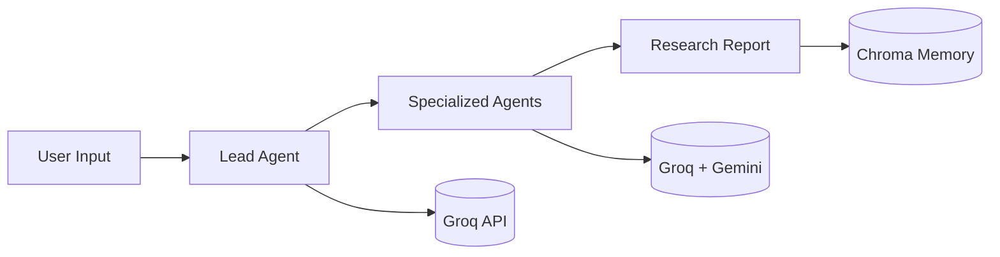

# Autonomous Research Orchestrator


  


 


Multi-agent AI system for academic research automation. Uses specialized agents to search, analyze, and summarize research papers.

## Architecture



## Tech Stack

- **CrewAI**: Agent orchestration framework
- **Groq API**: Fast LLM inference (llama-3.3-70B, Mixtral-8x7B)
- **Gemini API**: Long-context analysis (1M+ tokens)
- **Chroma DB**: Vector database for semantic search
- **Streamlit**: Web interface
- **Docker**: Containerized deployment

## Installation

### Prerequisites

- Python 3.11+
- Git
- API keys for Groq and Gemini

### Setup

```bash
# Clone repository
git clone https://github.com/yourusername/autonomous-research-orchestrator.git
cd autonomous-research-orchestrator

# Create and activate virtual environment
python3 -m venv venv
source venv/bin/activate  # On Windows: venv\Scripts\activate

# Install dependencies
pip install --upgrade pip
pip install -r requirements.txt

# Set up environment variables
cp .env.example .env
```

### API Keys Configuration

Edit `.env` file with your API keys:

```bash
GROQ_API_KEY=your_groq_api_key_here
GEMINI_API_KEY=your_gemini_api_key_here
```

**Get API Keys:**
- **Groq**: https://console.groq.com → API Keys
- **Gemini**: https://aistudio.google.com → Get API key

## Usage

### Local Development

```bash
# Activate virtual environment
source venv/bin/activate

# Run Streamlit app
streamlit run app.py

# Access at: http://localhost:8501
```

### Docker Deployment

```bash
# Build image
docker build -t research-orchestrator .

# Run container
docker run -p 8501:8501 --env-file .env research-orchestrator
```

### HuggingFace Spaces

Deploy by pushing to HuggingFace Spaces repository with proper README configuration.

## Project Structure

```
autonomous-research-orchestrator/
├── app.py                    # Streamlit web interface
├── crew.py                   # Agent coordination logic
├── requirements.txt          # Python dependencies
├── Dockerfile               # Container configuration
├── .env.example             # Environment variables template
├── agents/                  # AI agents
│   ├── lead_agent.py        # Main coordinator
│   ├── search_agent.py      # Paper search
│   ├── analysis_agent.py    # Content analysis
│   └── summary_agent.py     # Report generation
├── tools/                   # Utility functions
│   ├── arxiv_api.py         # arXiv API integration
│   └── chroma_memory.py     # Vector database operations
└── docs/                    # Documentation
    └── Project_Progress.md  # Development timeline
```

## Agents

1. **Lead Agent**: Plans research strategy and coordinates other agents
2. **Search Agent**: Finds relevant papers using arXiv API
3. **Analysis Agent**: Processes paper content and extracts insights
4. **Summary Agent**: Generates structured research reports

## Development

### Running Tests

```bash
# Install test dependencies
pip install pytest pytest-cov

# Run tests
pytest tests/

# Run with coverage
pytest --cov=agents --cov=tools tests/
```

### Code Quality

```bash
# Format code
black .

# Check imports
isort .

# Lint code
flake8 .
```

## Troubleshooting

### Common Issues

**Import errors**: Ensure virtual environment is activated
```bash
source venv/bin/activate
```

**API key errors**: Check `.env` file has correct keys
```bash
cat .env
```

**Port already in use**: Kill existing Streamlit processes
```bash
pkill -f streamlit
```

### Debug Mode

```bash
# Run with debug logging
streamlit run app.py --logger.level=debug
```

## Contributing

1. Fork the repository
2. Create feature branch (`git checkout -b feature/new-feature`)
3. Commit changes (`git commit -am 'Add new feature'`)
4. Push to branch (`git push origin feature/new-feature`)
5. Create Pull Request

## Performance

- **Response Time**: < 10 seconds per research query
- **Concurrent Users**: Supports multiple simultaneous requests
- **API Limits**: Respects free tier limits for Groq and Gemini
- **Memory Usage**: ~500MB for local deployment

## Cost

- **Development**: $0 (free APIs and tools)
- **Deployment**: $0 (HuggingFace Spaces free tier)
- **Scaling**: API costs only when exceeding free limits

## License

MIT License - see LICENSE file for details.

## Support

- **Issues**: Open GitHub issue for bugs or feature requests
- **Documentation**: Check docs/ folder for detailed guides
- **API Documentation**: See individual API provider docs

---

Built for advanced AI engineering and production deployment.